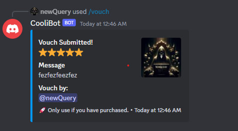

# Vouch discord bot

## Description

Add the `/vouch [message] [rating (1-5)]` to your discord server



## Table of Contents

- [Installation](#installation)
- [Usage](#usage)

## Installation

```sh
yarn install
```

Create a .env with the following

```sh
TOKEN="YOUR BOT TOKEN"
VOUCH_CHANNEL_NAME="THE VOUCH CHANNEL"  // By default it is vouches
```

## Usage

```sh
yarn start
```

/vouch [message] [rating (1-5)]

## Contact

- GitHub: [newQuery](https://github.com/newQuery)
- Email: nqzdo@pm.me
