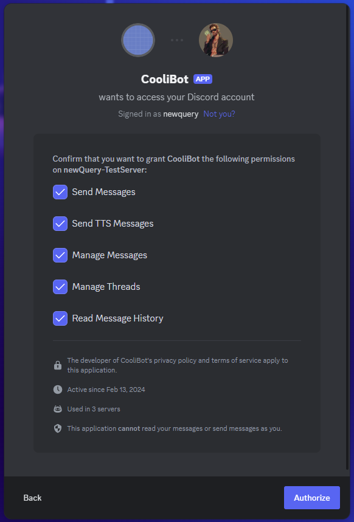

# Vouch discord bot

## Updates

- Added a `/restore`
- Added a `/wipe [nbrOfMessage]`

## Description

Add the `/vouch [message] [rating (1-5)]` to your discord server


## Table of Contents

- [Installation](#installation)
- [Usage](#usage)

## Installation

```sh
yarn install
```

Create a .env with the following

```sh
TOKEN="YOUR BOT TOKEN"
VOUCH_CHANNEL_NAME="THE VOUCH CHANNEL"
```

## Usage
```sh
yarn start
```

/vouch [message] [rating (1-5)]

Invite the bot with the following permissions :



## Common issues

### Unknown Integration

This error occurs when a command has been added, updated or modified and your server does not handle it properly.
To fix this simply kick your bot and invite it again. 

## Contact

- GitHub: [newQuery](https://github.com/newQuery)
- Email: nqzdo@pm.me
